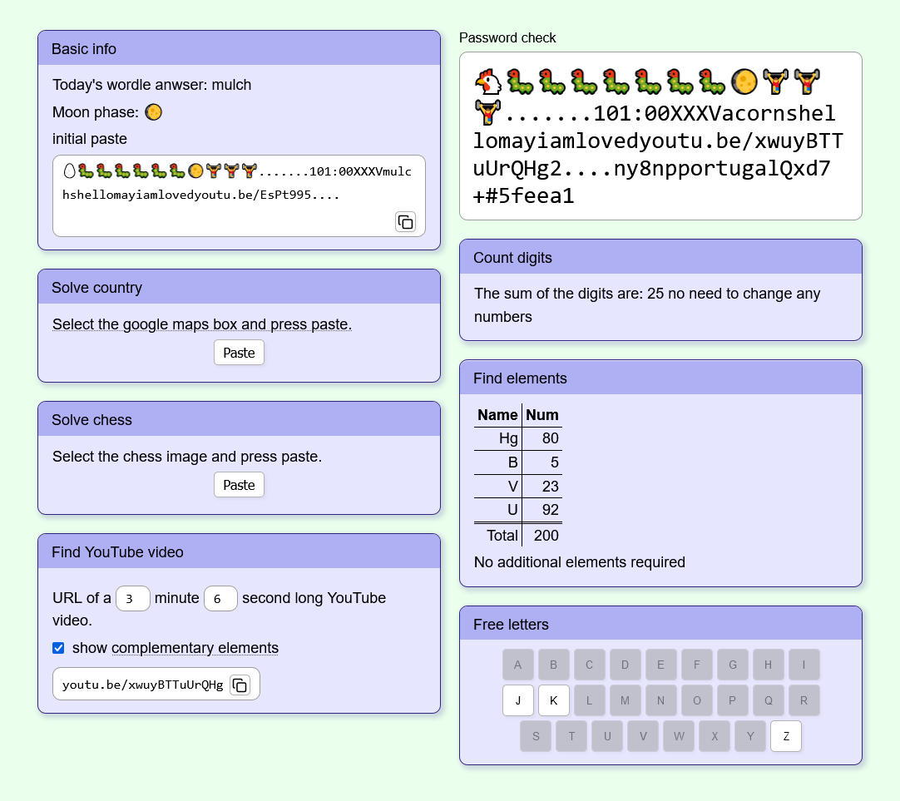

# The Password Game ultimate solver

This is a little site made to help solve The Password Game made by Neal Agarwal \
Check it out at [neal.fun](https://neal.fun)


This site is hosted on github pages. \
Check it out on [marcell-puskas.github.io/the-password-game-ultimate-solver/](https://marcell-puskas.github.io/the-password-game-ultimate-solver/)

You can also download the html file from the [releases section](https://github.com/Marcell-Puskas/The-Password-Game-Ultimate-solver/releases)



## Development

I made this project using vite. \
There is a plugin in it that builds the project into a single HTML file, so it can be easily distributed. \
It was also nice having Typescript.

### How to run on your machine

clone and install dependencies:
```
git clone https://github.com/Marcell-Puskas/The-Password-Game-Ultimate-solver.git
cd The-Password-Game-Ultimate-solver
npm install
```

to run the dev server:
```
npm run dev
```

to build and preview:
```
npm run build
npm run preview
```

## Other info

This project was inspired by GlowBlock64.
The URL list was taken from his spreadsheet \
Check him out on [YouTube](https://www.youtube.com/@glowblock64/)!

If you liked this project, please give it a star!